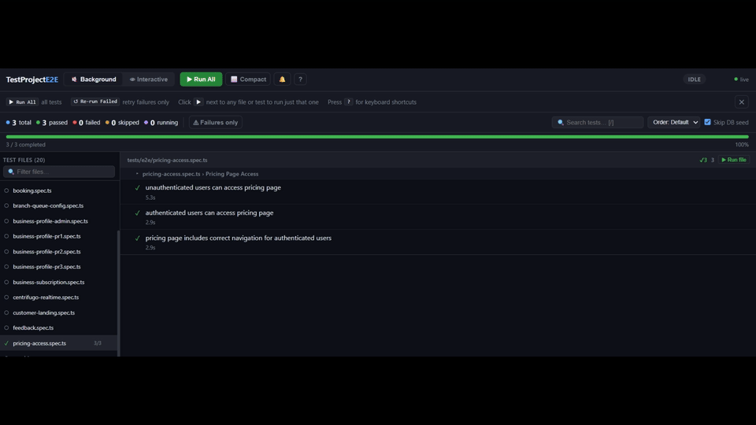

# playwright-skills


Two Playwright E2E skills for AI coding agents, shippable to **Claude Code**, **Codex CLI**, and **Cursor**.



| Skill | What it does |
|-------|--------------|
| **playwright-setup** | Scans project docs/source, interviews you, generates a complete Playwright E2E test suite + config from scratch. |
| **e2e-dashboard** | Installs a real-time Playwright test dashboard (live SSE progress, 14 features) into any project. |

---

## Claude Code (native plugin)

```text
/plugin marketplace add FaisalNoman/playwright-skills
/plugin install playwright-setup@playwright-skills
/plugin install e2e-dashboard@playwright-skills
```

Then trigger with `/playwright-setup` or `/e2e-dashboard`.

## Codex CLI

Codex has no plugin system — skills install as custom prompts (`~/.codex/prompts`).

```bash
git clone https://github.com/FaisalNoman/playwright-skills && cd playwright-skills
./install.sh codex          # macOS / Linux / Git Bash
# or on Windows PowerShell:
./install.ps1 codex
```

Then use `/playwright-setup` or `/e2e-dashboard` in Codex.

## Cursor

Cursor has no plugin system — skills install as project commands (`.cursor/commands`). Run from your project root:

```bash
git clone https://github.com/FaisalNoman/playwright-skills /tmp/playwright-skills
/tmp/playwright-skills/install.sh cursor          # writes ./.cursor/ in current project
# or PowerShell:
/tmp/playwright-skills/install.ps1 cursor
```

Then use `/playwright-setup` or `/e2e-dashboard` in Cursor.

---

## Why install differs per tool

Only Claude Code has a real plugin/marketplace system. Codex and Cursor load plain-markdown
prompts/commands, so the install scripts copy each skill's `SKILL.md` + assets into the tool's
prompt directory and drop a thin command file that points the agent at it. Single source of
truth stays in `plugins/<skill>/skills/<skill>/`.

## Layout

```
.claude-plugin/marketplace.json   # Claude marketplace manifest
plugins/<skill>/.claude-plugin/plugin.json
plugins/<skill>/skills/<skill>/   # SKILL.md + assets (source of truth)
codex/prompts/*.md                # Codex slash-command pointers
cursor/commands/*.md              # Cursor command pointers
install.sh / install.ps1          # per-tool installers
```

## License

MIT © FaisalNoman
